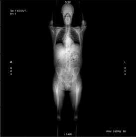
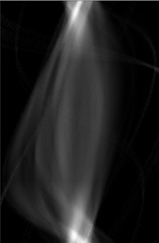
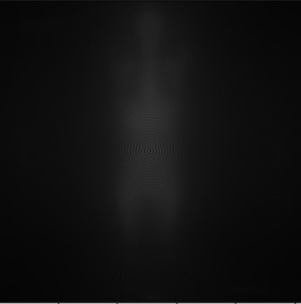
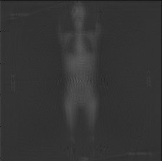

# Computed-Tomography-Simulator
> TalkTalk is a application which allows recreated image from emitters and detectors. To implementation we used a radon transform.

## Table of contents
* [General info](#general-info)
* [Original image](#original-image)
* [Sinogram](#sinogram)
* [Output image](#output-image)
* [Output image with filter](#output-image-with-filter)
* [Technologies](#technologies)
* [Created by](#created-by)

## General info
We use a conical model to  create a singoram from input image. If we have sinogram we can recreated original image using inverse Radon transform. 
To get a better picture we used a filter that reduced a noise.

## Original image

## Sinogram

## Output image

## Output image with filter

## Technologies
* Numpy - version 1.20.0
* Opencv-python - version 4.5.1.48
* Matplotlib - version 3.3.4
* Pydicom - version 2.1.2
* Ipywidgets - version 7.6.3

## Created by
Michał Olszewski
Martyna Mirkiewicz
